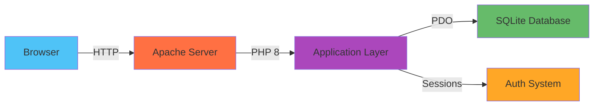

<div align="center">

# 💰 Personal Financial Management System

### _Track. Analyze. Prosper._

**A clean, secure, and minimal financial tracker built with PHP + SQLite**  
_Track your income, expenses, and reports — all offline and lightweight!_

<br>


[🚀 Get Started](#-installation-guide) • [📖 Documentation](#-overview) • [🤝 Contribute](#-contributing)

</div>

---Assign

<div align="center">

## 🌟 **Overview**

</div>

> The **Personal Financial Management System (PFMS)** empowers users to effortlessly manage their daily expenses, income, and view detailed monthly or annual summaries. Built with privacy in mind, it's fully offline using **SQLite**, written in **pure PHP (PDO)**, and features a sleek, responsive dark UI.

**Why PFMS?**

- 🔒 **100% Offline** — Your data never leaves your machine
- ⚡ **Lightning Fast** — SQLite ensures instant queries
- 🎨 **Beautiful UI** — Modern, clean, and intuitive interface
- 🔐 **Bank-Grade Security** — Encrypted passwords and session management

---

<div align="center">

## ⚙️ **Features**

</div>

<table>
<tr>
<td width="50%">

### 🔐 **Authentication**

- Secure signup and login system
- Password hashing with bcrypt
- Session-based authentication
- Auto-logout on inactivity

</td>
<td width="50%">

### 💵 **Transaction Management**

- Add income and expenses
- Edit and delete records
- Category-based organization
- Quick search and filters

</td>
</tr>
<tr>
<td width="50%">

### 📊 **Smart Reports**

- Monthly financial summaries
- Yearly trend analysis
- Category-wise breakdowns
- Visual charts (coming soon)

</td>
<td width="50%">

### 🚀 **Developer Friendly**

- Auto-creates database schema
- Modular MVC architecture
- Clean, documented code
- Easy to extend and customize

</td>
</tr>
</table>

---

<div align="center">

## 🏗️ **Tech Stack**

</div>



| Layer        | Technology     | Purpose                          |
| ------------ | -------------- | -------------------------------- |
| **Frontend** | HTML5, CSS3    | Responsive UI with dark theme    |
| **Backend**  | PHP 8 (PDO)    | Business logic and data handling |
| **Database** | SQLite 3       | Lightweight, file-based storage  |
| **Server**   | Apache (XAMPP) | Local development environment    |
| **Security** | Password Hash  | Bcrypt encryption for passwords  |

---

<div align="center">

## 📁 **Project Structure**

</div>

```plaintext
pfms/
├─ 📂 public/                  # Web-accessible files
│  ├─ 🏠 index.php             # Dashboard homepage
│  ├─ 📝 signup.php            # User registration
│  ├─ 🔑 login.php             # Authentication
│  ├─ 🚪 logout.php            # Session termination
│  └─ 📂 css/
│     └─ 🎨 styles.css         # Dark theme styles
│
├─ 📂 app/                     # Core application logic
│  ├─ ⚡ bootstrap.php         # Application initializer
│  └─ 🔐 Auth.php              # Authentication handler
│
├─ 📂 config/                  # Configuration files
│  └─ ⚙️ config.php            # Database & app settings
│
├─ 📂 storage/                 # Data persistence
│  └─ 💾 database.sqlite       # SQLite database file
│
└─ 🔒 .htaccess                # Apache rewrite rules
```

---

<div align="center">

## 🚀 **Installation Guide**

</div>

### **Prerequisites**

- PHP 8.0 or higher
- Apache server (XAMPP recommended)
- Git (for cloning)

### **Quick Start** ⚡

#### **Step 1:** Setup Environment

1. Download and install **[XAMPP](https://www.apachefriends.org/download.html)**
2. Launch XAMPP Control Panel
3. Start **Apache** service

#### **Step 2:** Clone Repository

```bash
# Navigate to XAMPP web directory
cd C:/xampp/htdocs/

# Clone the project
git clone https://github.com/kosaladathapththu/pfms.git

# Navigate to project
cd pfms
```

#### **Step 3:** Launch Application

1. Open your browser
2. Navigate to: `http://localhost/pfms/public/`
3. Click **"Get Started"**
4. Create your account
5. **Done!** ✅ The database auto-creates inside `/storage/database.sqlite`

> **Note:** No manual database setup required! The system automatically creates all necessary tables on first run.

---

<div align="center">

## 🖼️ **Screenshots**

</div>

<div align="center">

|    Login Interface     |  Dashboard View   |
| :--------------------: | :---------------: |
|     _Coming Soon_      |   _Coming Soon_   |
| Transaction Management | Financial Reports |
|     _Coming Soon_      |   _Coming Soon_   |

</div>

---

<div align="center">

## 🔒 **Security Features**

</div>

<table>
<tr>
<td width="50%">

### 🛡️ **Authentication**

- ✅ Password hashing via `password_hash()`
- ✅ Secure session management
- ✅ CSRF protection
- ✅ Brute force prevention

</td>
<td width="50%">

### 🔐 **Data Protection**

- ✅ SQL injection prevention (PDO)
- ✅ XSS attack mitigation
- ✅ Input validation & sanitization
- ✅ Local-only database access

</td>
</tr>
</table>

> **Privacy First:** Your financial data stays on your machine. No cloud. No tracking. No telemetry.

---

<div align="center">

## 🗺️ **Roadmap**

</div>

- [x] **Phase 1:** Core Authentication System
  - [x] User signup with validation
  - [x] Secure login/logout
  - [x] Session management
- [x] **Phase 2:** Transaction Management
  - [x] Add income records
  - [x] Track expenses
  - [x] Edit/delete functionality
- [x] **Phase 3:** Reporting System
  - [x] Monthly summaries
  - [x] Annual reports
  - [x] Category analysis
- [ ] **Phase 4:** Advanced Features _(In Progress)_
  - [ ] Oracle ↔ SQLite sync layer
  - [ ] Interactive Chart.js visualizations
  - [ ] Export to PDF/Excel
  - [ ] Budget planning tools
- [ ] **Phase 5:** UI Enhancement
  - [ ] Modern dashboard redesign
  - [ ] Tailwind CSS integration
  - [ ] Mobile-responsive optimization
  - [ ] Dark/Light theme toggle

---

<div align="center">

## 👥 **Our Team**

<table>
<tr>
<td align="center" width="33%">

<br>
<b>Kosala Daneshwara Athapaththu</b>
<br>
<sub>Full Stack Developer</sub>
<br><br>
<a href="https://github.com/kosaladathapththu"></a>
</td>
<td align="center" width="33%">

<br>
<b>Bimesh</b>
<br>
<sub>Developer</sub>
<br><br>
<a href="https://github.com/bimesh637"></a>
</td>
<td align="center" width="33%">

<br>
<b>Viraj Viduranga</b>
<br>
<sub>Developer</sub>
<br><br>
<a href="https://github.com/virajViduranga"></a>
</td>
</tr>
</table>

🎓 **Higher National Diploma in Software Engineering @ NIBM**  
📍 **Colombo, Sri Lanka**

</div>

---

<div align="center">

## 🤝 **Contributing**

</div>

We welcome contributions from the community! Here's how you can help:

### **How to Contribute**

1. **Fork** this repository
2. **Create** a feature branch
   ```bash
   git checkout -b feature/amazing-feature
   ```
3. **Commit** your changes
   ```bash
   git commit -m "Add some amazing feature"
   ```
4. **Push** to the branch
   ```bash
   git push origin feature/amazing-feature
   ```
5. **Open** a Pull Request

### **Contribution Guidelines**

- 📝 Write clear commit messages
- 🧪 Test your changes thoroughly
- 📚 Update documentation if needed
- 💬 Be respectful and constructive

---

<div align="center">

## 📄 **License**

This project is licensed under the **MIT License** — free to use, modify, and distribute with attribution.

See [LICENSE](LICENSE) file for details.

---

## ⭐ **Show Your Support**

If you find this project helpful, please consider giving it a ⭐ on GitHub!

---

<br>

**Made with ❤️ by [Kosala D. Athapaththu](https://github.com/kosaladathapththu)**

_"Manage your money smartly, securely, and simply."_

<br>

[](https://github.com/kosaladathapththu/pfms/stargazers)
[](https://github.com/kosaladathapththu/pfms/network/members)
[](https://github.com/kosaladathapththu/pfms/issues)

</div>
