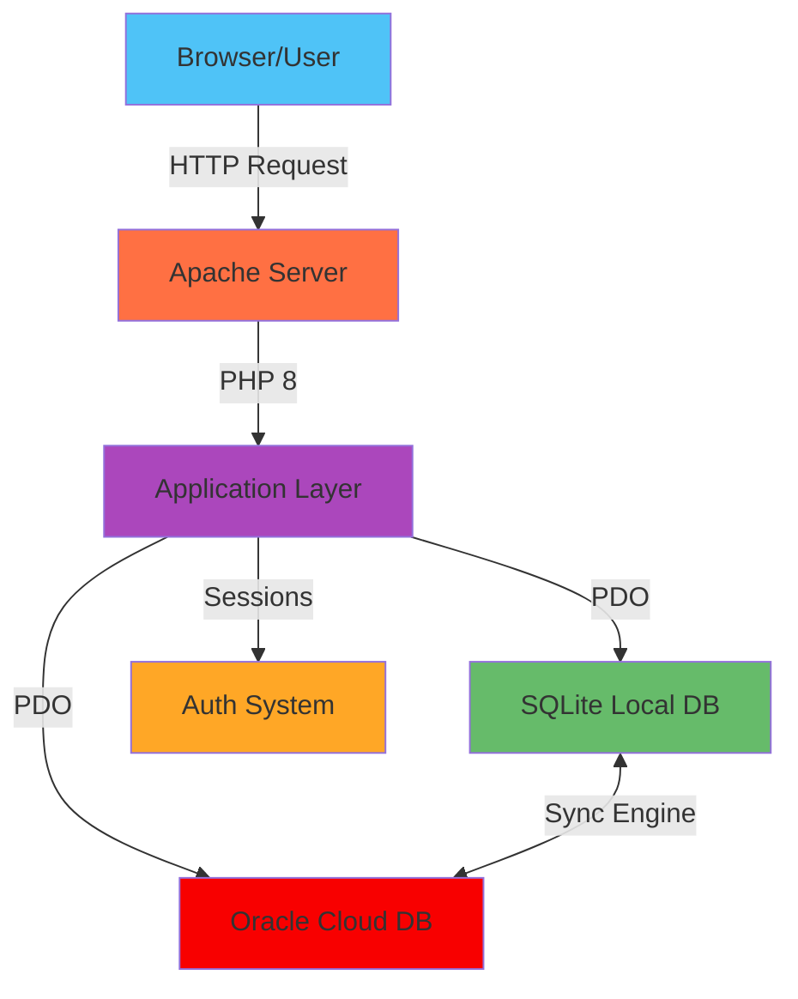

<div align="center">

# 💰 Personal Financial Management System

### *Track. Analyze. Prosper.*

**A clean, secure, and minimal financial tracker built with PHP + SQLite + Oracle**  
*Track your income, expenses, and reports — with cloud synchronization capabilities!*

<br>


[🚀 Get Started](#-installation-guide) • [📖 Documentation](#-overview) • [🤝 Contribute](#-contributing)

</div>

---

<div align="center">

## 🌟 **Overview**

</div>

> The **Personal Financial Management System (PFMS)** empowers users to effortlessly manage their daily expenses, income, and view detailed monthly or annual summaries. Built with flexibility in mind, it operates **offline with SQLite** for local storage and **syncs with Oracle Database** for cloud backup and multi-device access. Written in **pure PHP (PDO)** and featuring a sleek, responsive dark UI.

**Why PFMS?**
- 🔒 **Hybrid Architecture** — Work offline with SQLite, sync to Oracle Cloud
- ☁️ **Cloud Synchronization** — Backup and access data across devices
- ⚡ **Lightning Fast** — SQLite for instant local queries, Oracle for enterprise reliability
- 🎨 **Beautiful UI** — Modern, clean, and intuitive interface
- 🔐 **Bank-Grade Security** — Encrypted passwords and secure cloud sync

---

<div align="center">

## ⚙️ **Features**

</div>

<table>
<tr>
<td width="50%">

### 🔐 **Authentication**
- Secure signup and login system
- Password hashing with bcrypt
- Session-based authentication
- Auto-logout on inactivity

</td>
<td width="50%">

### 💵 **Transaction Management**
- Add income and expenses
- Edit and delete records
- Category-based organization
- Quick search and filters

</td>
</tr>
<tr>
<td width="50%">

### 📊 **Smart Reports**
- Monthly financial summaries
- Yearly trend analysis
- Category-wise breakdowns
- Visual charts (coming soon)

</td>
<td width="50%">

### 🚀 **Developer Friendly**
- Auto-creates database schema
- Modular MVC architecture
- Clean, documented code
- Easy to extend and customize

</td>
</tr>
<tr>
<td width="50%">

### ☁️ **Cloud Synchronization**
- Oracle Database integration
- Real-time data sync
- Multi-device access
- Automatic backup system

</td>
<td width="50%">

### 🔄 **Hybrid Database**
- SQLite for offline work
- Oracle for cloud storage
- Seamless data migration
- Conflict resolution

</td>
</tr>
</table>

---

<div align="center">

## 🏗️ **Tech Stack**

</div>



| Layer | Technology | Purpose |
|-------|------------|---------|
| **Frontend** | HTML5, CSS3 | Responsive UI with dark theme |
| **Backend** | PHP 8 (PDO) | Business logic and data handling |
| **Local Database** | SQLite 3 | Lightweight, offline file-based storage |
| **Cloud Database** | Oracle DB | Enterprise cloud synchronization |
| **Server** | Apache (XAMPP) | Local development environment |
| **Security** | Password Hash + SSL | Bcrypt encryption & secure connections |

---

<div align="center">

## 📁 **Project Structure**

</div>

```plaintext
pfms/
├─ 📂 public/                  # Web-accessible files
│  ├─ 🏠 index.php             # Dashboard homepage
│  ├─ 📝 signup.php            # User registration
│  ├─ 🔑 login.php             # Authentication
│  ├─ 🚪 logout.php            # Session termination
│  └─ 📂 css/
│     └─ 🎨 styles.css         # Dark theme styles
│
├─ 📂 app/                     # Core application logic
│  ├─ ⚡ bootstrap.php         # Application initializer
│  ├─ 🔐 Auth.php              # Authentication handler
│  └─ 🔄 Sync.php              # Oracle ↔ SQLite sync engine
│
├─ 📂 config/                  # Configuration files
│  ├─ ⚙️ config.php            # Database & app settings
│  └─ ☁️ oracle_config.php     # Oracle connection settings
│
├─ 📂 storage/                 # Data persistence
│  └─ 💾 database.sqlite       # SQLite local database
│
└─ 🔒 .htaccess                # Apache rewrite rules
```

---

<div align="center">

## 🚀 **Installation Guide**

</div>

### **Prerequisites**
- PHP 8.0 or higher
- Apache server (XAMPP recommended)
- Oracle Database 11g or higher (for cloud sync)
- Oracle Instant Client (for Oracle connectivity)
- Git (for cloning)

### **Quick Start** ⚡

#### **Step 1:** Setup Environment
1. Download and install **[XAMPP](https://www.apachefriends.org/download.html)**
2. Launch XAMPP Control Panel
3. Start **Apache** service

#### **Step 2:** Clone Repository
```bash
# Navigate to XAMPP web directory
cd C:/xampp/htdocs/

# Clone the project
git clone https://github.com/kosaladathapththu/pfms.git

# Navigate to project
cd pfms
```

#### **Step 3:** Configure Oracle Connection (Optional)
```bash
# Edit oracle_config.php in the config folder
nano config/oracle_config.php

# Add your Oracle credentials:
# - Host/IP address
# - Port (default: 1521)
# - Service name
# - Username & password
```

#### **Step 4:** Launch Application
1. Open your browser
2. Navigate to: `http://localhost/pfms/public/`
3. Click **"Get Started"**
4. Create your account
5. **Done!** ✅ The SQLite database auto-creates inside `/storage/database.sqlite`
6. **Enable Cloud Sync** (optional) from settings to sync with Oracle

> **Note:** The system works offline by default with SQLite. Oracle synchronization is optional and can be enabled in settings for cloud backup and multi-device access.

---

<div align="center">

## 🖼️ **Screenshots**

</div>

<div align="center">

| Login Interface | Dashboard View |
|:---:|:---:|
| *Coming Soon* | *Coming Soon* |
| Transaction Management | Financial Reports |
| *Coming Soon* | *Coming Soon* |

</div>

---

<div align="center">

## 🔒 **Security Features**

</div>

<table>
<tr>
<td width="50%">

### 🛡️ **Authentication**
- ✅ Password hashing via `password_hash()`
- ✅ Secure session management
- ✅ CSRF protection
- ✅ Brute force prevention

</td>
<td width="50%">

### 🔐 **Data Protection**
- ✅ SQL injection prevention (PDO)
- ✅ XSS attack mitigation
- ✅ Input validation & sanitization
- ✅ Secure Oracle connections (OCI8)

</td>
</tr>
<tr>
<td width="50%">

### ☁️ **Cloud Security**
- ✅ Encrypted data transmission
- ✅ SSL/TLS for Oracle sync
- ✅ Secure credential storage
- ✅ Token-based authentication

</td>
<td width="50%">

### 🔄 **Sync Protection**
- ✅ Conflict resolution
- ✅ Data integrity checks
- ✅ Rollback on failure
- ✅ Version control

</td>
</tr>
</table>

> **Privacy Options:** Work completely offline with SQLite, or optionally enable Oracle sync for cloud backup. You control where your data lives!

---

<div align="center">

## 🗺️ **Roadmap**

</div>

- [x] **Phase 1:** Core Authentication System
  - [x] User signup with validation
  - [x] Secure login/logout
  - [x] Session management
  
- [x] **Phase 2:** Transaction Management
  - [x] Add income records
  - [x] Track expenses
  - [x] Edit/delete functionality
  
- [x] **Phase 3:** Reporting System
  - [x] Monthly summaries
  - [x] Annual reports
  - [x] Category analysis

- [x] **Phase 4:** Oracle Cloud Integration
  - [x] Oracle database connectivity
  - [x] Bidirectional sync engine
  - [x] Conflict resolution system
  - [x] Automatic cloud backup
  
- [ ] **Phase 5:** Advanced Features *(In Progress)*
  - [ ] Real-time sync notifications
  - [ ] Multi-user collaboration
  - [ ] Export to PDF/Excel
  - [ ] Budget planning tools
  
- [ ] **Phase 6:** UI Enhancement
  - [ ] Modern dashboard redesign
  - [ ] Tailwind CSS integration
  - [ ] Mobile-responsive optimization
  - [ ] Dark/Light theme toggle

---

<div align="center">

## 👥 **Our Team**

<table>
<tr>
<td align="center" width="33%">

<br>
<b>Kosala Daneshwara Athapaththu</b>
<br>
<sub>Full Stack Developer</sub>
<br><br>
<a href="https://github.com/kosaladathapththu"></a>
</td>
<td align="center" width="33%">

<br>
<b>Bimesh</b>
<br>
<sub>Developer</sub>
<br><br>
<a href="https://github.com/bimesh637"></a>
</td>
<td align="center" width="33%">

<br>
<b>Viraj Viduranga</b>
<br>
<sub>Developer</sub>
<br><br>
<a href="https://github.com/virajViduranga"></a>
</td>
</tr>
</table>

🎓 **Higher National Diploma in Software Engineering @ NIBM**  
📍 **Colombo, Sri Lanka**

</div>

---

<div align="center">

## 🤝 **Contributing**

</div>

We welcome contributions from the community! Here's how you can help:

### **How to Contribute**

1. **Fork** this repository
2. **Create** a feature branch
   ```bash
   git checkout -b feature/amazing-feature
   ```
3. **Commit** your changes
   ```bash
   git commit -m "Add some amazing feature"
   ```
4. **Push** to the branch
   ```bash
   git push origin feature/amazing-feature
   ```
5. **Open** a Pull Request

### **Contribution Guidelines**
- 📝 Write clear commit messages
- 🧪 Test your changes thoroughly
- 📚 Update documentation if needed
- 💬 Be respectful and constructive

---

<div align="center">

## 📄 **License**

This project is licensed under the **MIT License** — free to use, modify, and distribute with attribution.

See [LICENSE](LICENSE) file for details.

---

## ⭐ **Show Your Support**

If you find this project helpful, please consider giving it a ⭐ on GitHub!

---

<br>

**Made with ❤️ by the PFMS Team**

*"Manage your money smartly, securely, and simply."*

<br>

[](https://github.com/kosaladathapththu/pfms/stargazers)
[](https://github.com/kosaladathapththu/pfms/network/members)
[](https://github.com/kosaladathapththu/pfms/issues)

</div>
